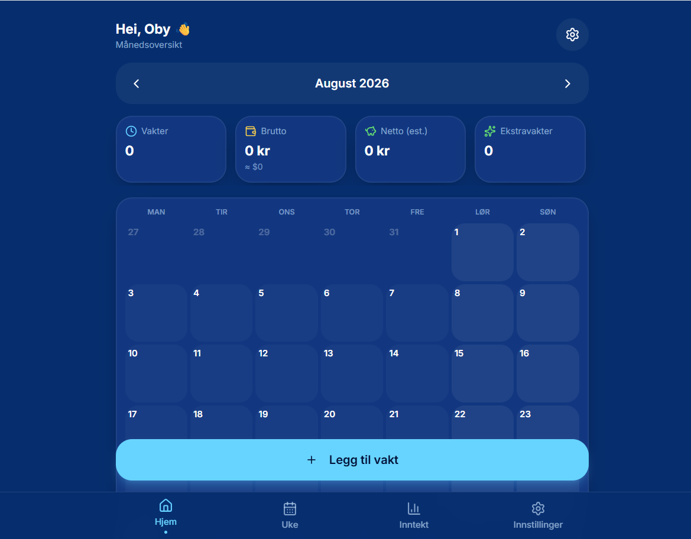
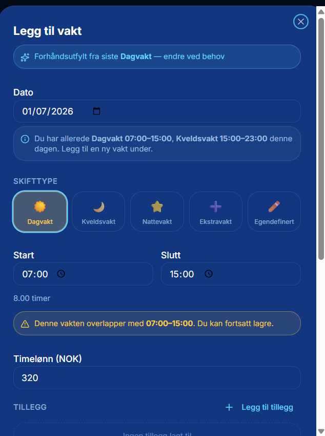

# 📅 MinVakt

> Skiftplanlegger og inntektskalkulator for norsk helsepersonell


---

> **MinVakt er utviklet med norsk helsevesen i tankene.**
> Appen bruker norske skiftbetegnelser, norske lønnssatser,
> norsk skatteberegning og er tilpasset turnusarbeid
> i norske helseinstitusjoner.

---

## Hvorfor MinVakt?

Sykepleiere og annet helsepersonell i Norge jobber
turnus — dag, kveld, natt, helg og ekstravakter.
Å holde oversikt over vakter, beregne inntekt og
forstå hva man faktisk tjener etter skatt er
tidkrevende og uoversiktlig.

GAT og andre turnussystemer viser vaktene dine —
men de forteller deg ikke hva du tjener.
Lønnsslippen kommer måneden etter.

**MinVakt ble bygget for å gi deg oversikten
— i sanntid, på telefonen din.**

---

## Hva er MinVakt?

En mobilapp der helsepersonell kan registrere vakter,
beregne inntekt med tillegg, og få full oversikt
over månedlig og årlig inntekt — med norsk
skatteberegning inkludert.

---

## Funksjoner

### Skiftregistrering
- 📅 Måneds- og ukeskalender med fargekodet oversikt
- ☀️ Dagvakt / 🌙 Kveldsvakt / ⭐ Nattevakt / ➕ Ekstravakt
- ✏️ Egendefinerte skifttyper
- 👥 Flere vakter på samme dag
- 🏥 Registrer arbeidssted per vakt

### Inntekt og tillegg
- 💰 Automatisk beregning av bruttoinntekt
- 📊 Egendefinerte tillegg (kveldsrate, helgetillegg,
  ansvarstillegg og mer)
- 💱 Støtte for NOK og USD
- 🧮 Norsk skatteberegning (justerbar skatteprosent)
- 📥 Last ned lønnsrapport

### Smarte funksjoner
- ⚡ Hurtigutfylling fra siste brukte vakt
- 💾 Lagrede satser (f.eks. "Kveldsrate 45 kr/t")
- 📍 Lagrede arbeidssteder
- 📈 Statistikk per måned, kvartal og år

---

## For hvem?

| Rolle | Nytte |
|---|---|
| 👩‍⚕️ Sykepleier | Full oversikt over turnus og inntekt |
| 🏥 Hjelpepleier / Helsefagarbeider | Beregn tillegg og ekstravakter |
| 🎓 Sykepleierstudent | Lær å forstå lønn og turnus |
| 💊 Vernepleier / Miljøterapeut | Tilpasset for alle helseroller |
| 🩺 Fysioterapeut / Ergoterapeut | Fleksibel for alle turnustyper |

---

## Skjermbilder

### Dashboard — månedsoversikt


### Legg til vakt


### Inntektsoversikt


---

## Status

MinVakt er i aktiv utvikling. Nåværende versjon (v0.9 MVP):

- ✅ Måneds- og ukeskalender
- ✅ Alle skifttyper inkludert egendefinerte
- ✅ Flere vakter samme dag
- ✅ Egendefinerte tillegg med timeberegning
- ✅ Hurtigutfylling fra siste brukte vakt
- ✅ Lagrede satser og arbeidssteder
- ✅ NOK og USD støtte
- ✅ Norsk skatteberegning

Planlagt fremover:
- 📲 Eksport til kalender (Google/Apple)
- 📊 Årsrapport for skattemelding
- 🔔 Påminnelser om kommende vakter
- 👥 Deling med kolleger

---

## ⚠️ Ansvarsfraskrivelse

MinVakt er et personlig planleggings- og
estimeringsverktøy. Inntektsberegninger er
estimater basert på brukerens egne inndata
og erstatter ikke offisiell lønnsslipp,
tariffavtale eller skatterådgivning.

---

## 👩‍⚕️ Bygget av

**Augustina Ajemba**
Autorisert sykepleier | Avansert klinisk sykepleier | Health-IT

[🌐 Portefølje](https://augustinaajemba.github.io) · [💼 LinkedIn](https://linkedin.com/in/augustina-ajemba) · [🐙 GitHub](https://github.com/augustinaajemba)

---

## Relaterte prosjekter

- 🏥 [KliniskSim](https://github.com/augustinaajemba/klinisksim) — AI-drevet klinisk treningssimulator for sykepleierstudenter

---

## Lisens

```
Copyright (c) 2026 Augustina Ajemba — Alle rettigheter forbeholdt.

Dette repositoriet er tilgjengelig for porteføljevisning.
Ingen deler av koden eller innholdet kan kopieres,
distribueres eller brukes kommersielt uten
skriftlig tillatelse fra opphavsrettsinnehaver.
```
